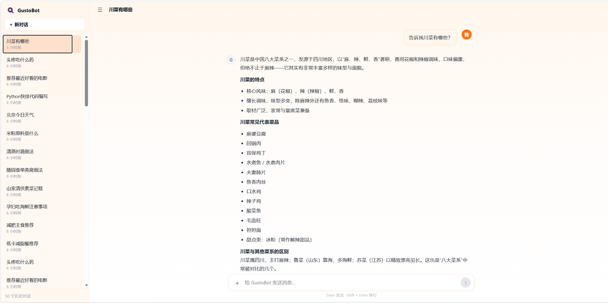

<div align="center">


# FlavorHub · 中华美食智能助手

**一个会记住你口味的多轮对话式菜谱 Agent**

基于知识图谱 + 向量检索 + 三层记忆架构，把「菜谱问答」做成一套**有记忆、可评测、可复现**的工程系统。

<br/>


</div>

<br/>

<div align="center">

<br/>
<sub>▲ FlavorHub 对话界面：左侧会话列表 + 右侧流式对话（含参考来源与调用链路标注）</sub>
</div>

---

## 一、项目介绍

### 这是什么

**FlavorHub** 是一个面向中华美食领域的对话式 AI 助手。它不只是「查菜谱」——它能**查菜谱**、**讲饮食文化**、**做结构化统计**、**对照多个菜品的差异**，并且**记住每一位用户的口味和忌口**。

### 能做什么

| 能力 | 示例提问 |
|---|---|
| **菜谱检索** | 「西红柿疙瘩汤怎么做好吃？」 |
| **饮食文化 / 古籍典故** | 「《随园食单》里的栗子糕怎么做？」「明朝引进了哪些蔬菜？」 |
| **结构化统计** | 「你们有多少道热菜？」「川菜里有哪些凉菜？」 |
| **多菜品对比** | 「改良版孜然牛肉和豌豆黄哪个更辣？」 |
| **个性化记忆** | 说过一次「我不吃辣」，之后每次推荐都会自动避开 |
| **边界处理** | 与饮食无关的问题会礼貌拒答，信息不足时会主动追问 |

### 技术架构

```
                    ┌─────────────────────────────────┐
   用户提问  ──────▶ │  意图路由（LLM Router）           │
                    └───────────────┬─────────────────┘
                                    │
        ┌───────────────┬───────────┴───────────┬────────────────┐
        ▼               ▼                       ▼                ▼
   ┌─────────┐    ┌──────────┐          ┌────────────┐   ┌──────────┐
   │ 图谱查询 │    │ 向量检索  │          │ 结构化统计  │   │ 通用问答 │
   │ Neo4j   │    │ Milvus   │          │ Text2SQL   │   │ LLM      │
   └─────────┘    └──────────┘          └────────────┘   └──────────┘
        │               │                       │                │
        └───────────────┴───────────┬───────────┴────────────────┘
                                    ▼
                    ┌─────────────────────────────────┐
                    │  三层记忆（短期 / 会话 / 长期）    │
                    └───────────────┬─────────────────┘
                                    ▼
                    ┌─────────────────────────────────┐
                    │  答案生成 + 流式输出（SSE）        │
                    └─────────────────────────────────┘
```

**技术栈**

| 层 | 技术 |
|---|---|
| 编排 | **LangGraph** 多智能体状态机 |
| 图谱 | **Neo4j**（19,655 道菜品 + 食材 / 工艺 / 口味 / 功效关系） |
| 向量 | **Milvus**（菜谱 + 8 本古籍，DashScope `text-embedding-v3`） |
| 结构化 | **MySQL / PostgreSQL** + Text2SQL |
| 后端 | **FastAPI** + 原生 SSE 流式 |
| 前端 | **Vue 3** + Vite + TypeScript |
| 部署 | **Docker Compose** 一键拉起全栈 |

### 关于项目的来源

> **FlavorHub 的起点是 [@skygazer42](https://github.com/skygazer42) 的开源项目 [GustoBot](https://github.com/skygazer42/GustoBot)。**
>
> 上游作者完成了**多源 RAG 架构、LangGraph 编排、知识图谱构建、Docker 全栈编排**等
> 大量基础工作 —— 这是一份很有价值的开源贡献。**没有它就没有这个项目。**
>
> 在此向上游作者致以**诚挚的感谢** 🙏。如果你觉得这个方向有意思，**请先去给上游仓库点个 ⭐**。
>
> - 上游仓库：https://github.com/skygazer42/GustoBot
> - 原项目说明保留于 [`docs/UPSTREAM_README.md`](docs/UPSTREAM_README.md)
>
> **⚠️ 命名说明**：本仓库改名为 **FlavorHub**，但**代码包名仍沿用上游的 `gustobot/`** ——
> 重命名包会牵动数十个文件的导入路径，收益不抵风险，故保持不动。

> **本项目的许可与上游一致：Apache-2.0。**

---

## 二、做出的改进

> 上游提供了一套可用的基础系统。**我在此基础上做了四件事，把它从「能跑通」推进到「有记忆、可量化、可复现」。**

### 1️⃣ 扩充纯文本类数据：新增八大中华饮食古籍

上游的知识库偏重**菜谱做法**，饮食文化部分较薄。我系统性地补入了 **8 本中国饮食古籍的完整译文**：

| 书名 | 朝代 | 条目数 | 书名 | 朝代 | 条目数 |
|---|---|---|---|---|---|
| 《清异录》 | 宋 | 747 | 《易牙遗意》 | 明 | 168 |
| 《饮膳正要》 | 元 | 612 | 《山家清供》 | 宋 | 106 |
| 《随园食单》 | 清 | 377 | 《云林堂饮食制度集》 | 元 | 50 |
| 《饮食须知》 | 元 | 372 | 《本心斋疏食谱》 | 宋 | 22 |

**合计 2,454 条内容 chunk，全部灌入 Milvus 向量库。**

涵盖了中国饮食文化中最有代表性的一批典籍：

- **《随园食单》** —— 袁枚的烹饪美学，清代饮食集大成之作
- **《山家清供》** —— 宋代山野素食，文人清趣
- **《饮膳正要》** —— 元代宫廷食疗，忽思慧奉敕编撰
- **《饮食须知》** —— 食物性味与禁忌
- **《清异录》** —— 五代宋初饮食轶事，典故极丰
- **《易牙遗意》 / 《云林堂饮食制度集》 / 《本心斋疏食谱》** —— 元明时期的家常与文人食谱

**数据处理做了三件事**：

1. **全文翻译为现代白话**（原文为文言，直接检索命中率低），同时**保留「卷 / 门 / 单」的原书结构**与条目名
2. **出处写进内容**（`《书名》门类·条目名：译文`），让检索结果可溯源
3. **入库前做幂等检查与校验**，避免重复灌入

**效果**：现在可以问「《随园食单》里的栗子糕怎么做」「明朝引进了哪些蔬菜」「吃豹肉有什么禁忌」这类**文化型问题**，系统能给出有据可查的答案。

### 2️⃣ 添加记忆机制：短期记忆 + 会话记忆 + 长期记忆

上游的对话状态**只增不减**——每轮对话都会把新消息追加进上下文，几轮之后 prompt 就会膨胀到撑爆模型窗口；而且**换一个会话就彻底失忆**。

我实现了一套**三层记忆架构**：

| 层级 | 名称 | 载体 | 作用范围 | 内容 |
|---|---|---|---|---|
| **L1** | **短期记忆** | `state.messages` | 当前会话，最近 N 轮 | **原文**，保证对话连贯 |
| **L2** | **会话记忆** | `state.memory` | 当前会话，超出窗口的历史 | **结构化摘要**，压缩后继续参与推理 |
| **L3** | **长期记忆** | `user_memories` 表 | **跨会话，按用户隔离** | 累积的用户画像 |

#### 短期记忆：窗口裁剪（真删，不是「拼 prompt 时跳过」）

保留最近 5 轮对话原文，更早的消息用 LangGraph 的 `RemoveMessage` **从状态里真正删除**。

> **为什么要「真删」而不是「拼 prompt 时过滤」**：后者只是让 prompt 变短，
> `state.messages` 和 checkpoint **照样无限膨胀**——那才是病根。

#### 会话记忆：结构化 JSON 压缩

被挤出窗口的历史，会由 LLM 抽取成一组**结构化字段**：

```json
{
  "constraints": ["不吃辣", "对花生过敏"],        // 硬性约束
  "relaxed": [],                                  // 用户后来取消的限制
  "preferences": {"口味": "清淡"},                 // 口味偏好
  "dishes": ["红烧肉", "冬瓜排骨汤"],               // 提到的菜
  "facts": ["用户叫阿强", "用户住在成都"],          // 用户自述信息
  "answered": [{"q": "红烧肉炖多久", "a": "约一小时"}]  // 已问过的问题
}
```

**关键设计：LLM 只负责「抽增量」，合并规则由代码确定性执行。**

```python
async def extract_delta(overflow) -> dict    # LLM：只从这段对话里抽增量
def merge_memory(previous, delta) -> dict    # 代码：确定性合并（纯函数，可单测）
```

每个字段的**合并语义都不同**，这是刻意的：

| 字段 | 合并规则 | 原因 |
|---|---|---|
| `constraints` | **只增去重** | 硬约束（忌口 / 过敏）丢了是事故 |
| `relaxed` | 并集 | 用户**主动解除**的限制不能当作禁忌 |
| `preferences` | **键覆盖** | 用户改了口味要生效 |
| `dishes` / `facts` | **并集** | 信息应累积 |
| `answered` | **按问题去重** | 同一问题不重复记录 |

> **相比「让 LLM 重写整段摘要」**：那种做法每轮都是一次有损压缩，
> 旧字段会在重写中被悄悄丢掉，而且不可复现。现在**最坏只丢一轮的增量**。

#### 长期记忆：跨会话的用户画像

会话记忆会**持久化到 `user_memories` 表**（按 `user_id` 隔离），并在**新会话开始时作为基底加载**——
所以**换一个会话，它依然记得你叫什么、住在哪、有什么忌口**。

#### 三个让记忆真正「可用」的细节

**① 「撤回」不做成删除。** 用户说「花生那个限制不用管了」时，如果直接删掉 `constraints`，
跨会话再问时模型会**什么都不知道**，只能反问用户。所以设计了 `relaxed` 字段（记为"已解除"），
注入时会明确渲染成：

```
硬性约束（必须遵守，不得违背）：不吃辣
用户已主动解除的限制（不要再拿它当禁忌）：对花生过敏
```

**② 禁止把「无效结论」写进记忆。** 记忆系统最危险的失败模式不是「记不住」，
而是**把错误的结论记进去并每轮注入**——错误答案会自我强化。
所以抽取规则明令禁止把「没找到 / 无法回答 / 不在范围内」这类**没有实质信息**的回答写进 `answered`。

**③ 用户身份需要专门字段。** 「我叫阿强，在成都」既不是约束、不是偏好、也不是提问——
早期会被抽取器直接丢弃。加了 `facts` 字段之后才真正记得住「用户是谁」。

**效果**：在 80 条跨会话 + 80 条会话内的记忆专项评测中，**召回率分别达到 98.75% / 97.50%**，
且**零污染**（不会把不存在的约束当成事实）。

### 3️⃣ 构建完整的测评集，覆盖多项指标并得出量化结果

上游没有成体系的评测。我建立了一套 **251 条 × 9 个维度**的评测流水线，**一条命令产出全部指标**。

#### 测评集：251 条，覆盖 7 类任务

| 场景 | 条数 | 内容 |
|---|---|---|
| `recipe_search` | 90 | 菜谱查询 |
| `history_faq` | 56 | 饮食典故 / 古籍专项 |
| `recipe_detail` | 25 | 菜品细节 |
| `recipe_compare` | 25 | 多菜品对比 |
| `negative` | 25 | **负例**（该拒答的问题） |
| `stat_query` | 20 | 结构化统计 |
| `multi_turn` | 10 | 多轮对话 |

每条题目都标注了 `expected_route` / `expected_tool` / `expected_slots` / `relevant_ids` /
`expected_answer_keywords` / `ground_truth`，**判据可回溯到原始数据**。

**其中 80 条是为了新增的古籍专门生成的** —— 采用「**LLM 生成问句 + 脚本校验**」的方式：
`relevant_ids` 必须是 Milvus 里真实存在的 id、期望关键词必须真在原文里，**不满足就丢弃**，
保证题目本身不会「问一个库里根本没有的东西」。

#### 九个评测维度

| 维度 | 指标 | 覆盖能力 |
|---|---|---|
| **意图路由** | `intent_accuracy` / `slot_accuracy` | 问题分类是否准确 |
| **知识检索** | `recall@k` / `MRR@k` / `nDCG@k` | 能不能找到正确内容、排序好不好 |
| **工具选择** | `tool_accuracy` / `args_accuracy` | 该走哪条查询路径、参数对不对 |
| **幻觉控制** | `claim_hallucination_rate` / `groundedness` | 有没有编造事实 |
| **答案质量** | `key_fact_coverage` / LLM-Judge 三维打分 | 回答是否完整、相关、忠实 |
| **端到端** | `intent` / `key_fact` / `rejection` | 完整链路表现 |
| **拒答正确性** | `reject_rate` / `answer_rate` | 该拒的拒了没、该答的答了没 |
| **跨会话记忆** | `recall` / `pass_rate` / `poison_rate` | 新会话能否继承用户画像 |
| **会话内记忆** | 同上 + `window_overflow_rate` | 超长对话下还能否记得前面说的话 |

评测器全部支持 **进度条 + 剩余时间估计**，跑 200+ 条不再是刷不完的日志。
详细指标定义与复现方式见 [`eval/README.md`](eval/README.md)。

> **量化结果见下一章。**

### 4️⃣ 重构前端页面，加入真实流式输出

#### 前端整体重构

上游是一个单页 widget。我重写成 **ChatGPT 风格的双栏布局**：

- **左侧会话列表** —— 多会话切换、时间显示、删除（带二次确认）
- **右侧对话区** —— 消息气泡、markdown 渲染、附件上传
- **暖色调设计** —— 淡黄渐变底色 + 橙色主色，贴合「美食」主题

#### 真实流式输出

**上游的「流式」是模拟的** —— 先等完整回答生成完，再按空格拆分、逐个 `sleep` 发送。
**中文没有空格，等于整段一次性发出**——用户还是要干等十几秒。

我改成消费 LangGraph 的 **`stream_mode="messages"`** 事件流，把 LLM 的**真实 token** 通过
**SSE（Server-Sent Events）** 逐个推给前端，并处理了三个细节：

| 细节 | 处理 |
|---|---|
| **内部节点过滤** | 路由 / 幻觉自检 / 检索计划等**内部节点的 token 不能吐给用户**，需要按 tag 过滤 |
| **重复输出** | 容器节点（内部跑子图）会把回答推两遍，需要识别并去重 |
| **刷新后丢失** | 流式回答原本**不落库**，刷新页面就没了；补上了持久化 |

#### 附带的可观测性

每条回答下方会显示**调用链路线注**（不干扰正文）：

```
路由 kb-query   ·   置信度 0.90   ·   来源 5
```

帮助定位「这次回答是怎么来的」，也便于排查问题。

---

## 三、测试效果

> 以下为**本机实测**结果，全部可通过 `eval/scripts/` 下的评测器复现。
>
> **每个指标的分母不同**（过滤条件不一样），我特意标出来 ——
> 只写百分比不写分母，容易让读者误以为都是全量 251 条的结果。

### 3.1 核心指标总览

| 指标 | 数值 | 分母 | 说明 |
|---|---|---|---|
| **Intent Accuracy** | **81.67%** | 251 | 问题意图分类正确率 |
| **Slot Accuracy（loose）** | **99.60%** | 251 | 结构化槽位抽取（语义口径） |
| **Recall@1** | **92.77%** | 196 | Top-1 命中率 |
| **Recall@3** | **96.99%** | 196 | Top-3 命中率 |
| **Recall@5** | **98.19%** | 196 | Top-5 命中率 |
| **MRR@5** | **95.08%** | 196 | 首个正确答案的平均排名倒数 |
| **nDCG@5** | **95.36%** | 196 | 排序整体质量 |
| **Tool Selection Accuracy** | **90.00%** | 80 | 查询路径选择正确率 |
| **Args Accuracy** | **80.63%** | 80 | 工具参数匹配率 |
| **Key Fact Coverage** | **78.36%** | 171 | 回答覆盖关键信息点的比例 |
| **Rejection Accuracy** | **85.71%** | 14 | 拒答判断正确率 |
| **Hallucination Rate** | **3.57%** | 1932 条声明 | 与事实**明确矛盾**的比例（见 3.4） |

**一句话概括**：**检索很稳（Recall@5 98%）、意图和工具选择良好（82% / 90%）、
回答质量可用（关键信息覆盖 78%）、事实性可靠（真幻觉仅 3.57%）。**

### 3.2 分场景 Intent Accuracy

| 场景 | n | Intent | 场景 | n | Intent |
|---|---|---|---|---|---|
| `stat_query` | 20 | **100%** | `history_faq` | 56 | 85.71% |
| `recipe_detail` | 25 | 92.00% | `recipe_search` | 90 | 80.00% |
| `multi_turn` | 10 | 90.00% | `negative` | 25 | 68.00% |
| | | | `recipe_compare` | 25 | **64.00%** |

**统计类问题 100% 准确**（「有多少道热菜」这类特征明显）；
**多菜品对比最低（64%）** —— 需要同时抽取两个菜名，模型常只抽出一个，这是已知短板。

### 3.3 分场景检索质量

| 场景 | n | Recall@1 |
|---|---|---|
| `recipe_detail` | 25 | **100%** |
| `recipe_compare` | 25 | 93.33% |
| `recipe_search` | 90 | 92.86% |
| `history_faq` | 56 | 89.29% |

**古籍类问题（`history_faq`）也能达到 89.29%** —— 说明新增的 2454 条古籍内容确实能被检索到。

### 3.4 关于「幻觉率」的口径说明

我把**两个数字**都列出来，因为它们的含义完全不同：

| 指标 | 数值 | 含义 |
|---|---|---|
| **`claim_contradiction_rate`** | **3.57%** | **与标准答案明确矛盾** ← **这才是通常说的「幻觉」** |
| `claim_hallucination_rate` | 51.50% | **未被标准答案直接支持**的声明占比 |
| `groundedness` | 48.50% | 有据可依的比例 |

**为什么第二个数字这么高？** 因为它把下面这些都算进去了：

- **常识补充**（「适合配粥」）
- **合理推断**（从做法推出「咸鲜口味」）
- **表述差异**（同一事实的不同说法）
- 甚至**模型自述「我没查到 X」**（这是真话）

**真正编造事实的情况只有 3.57%。** 我认为**如实标注口径，比报一个漂亮的数字更重要**。

### 3.5 记忆专项评测

| 维度 | Recall | Pass Rate | Poison Rate | 样本 |
|---|---|---|---|---|
| **跨会话记忆** | **98.75%** | 98.75% | **0%** | 80 |
| **会话内记忆** | **97.50%** | 97.50% | **0%** | 80 |

- **跨会话**：验证「新开会话后，还能否记得用户身份与约束」
- **会话内**：含 **17 轮超长程用例**（关键信息埋在第 1 句、追问在第 17 轮），
  验证**深层压缩后仍能召回**
- **`Poison Rate = 0%`**：说明系统**不会把不存在的约束当成事实记住**

### 3.6 记忆机制的实际效果演示

**场景：用户随口说了一句忌口，之后每次推荐都会被记住。**

```
第 1 轮  用户：我不吃辣，另外对花生过敏
         （此时信息进入短期记忆）

第 6 轮  用户：推荐一道下饭菜
         系统：（已从短期记忆压缩进会话记忆）「推荐糖醋里脊，不含辣也不含花生…」
         （中间 4 轮对话已被裁剪，但关键约束没丢）

—— 关闭页面，第二天新开会话 ——

新会话   用户：我有什么忌口来着？
         系统：「你不吃辣，对花生过敏」（从长期记忆加载）
```

**另一个场景：用户改变主意。**

```
用户：花生那个限制不用管了
      （旧约束移入 relaxed 字段，而非简单删除）

之后  用户：我现在能吃什么坚果？
      系统：「花生没问题了，可以放心吃～」（不会再把它当禁忌）
```

---

## 四、如何启动并测试

### 4.1 环境要求

| 依赖 | 版本 | 用途 |
|---|---|---|
| **Docker** + Docker Compose | 20.10+ | 拉起 Milvus / Neo4j / PostgreSQL / MySQL / Redis |
| **Python** | 3.10 | 后端 |
| **Node.js** | 18+ | 前端 |

> Milvus、Neo4j 等中间件**全部由 `docker-compose.yml` 编排**，不需要单独安装。

### 4.2 获取代码

```bash
git clone https://github.com/iceandfireandwater/FlavorHub.git
cd FlavorHub
```

> ⚠️ 仓库使用 **Git LFS** 管理大文件（`data/recipe.json`）。
> 如果 clone 后该文件只有几百字节，说明没拉到实际内容：

```bash
git lfs install && git lfs pull
```

### 4.3 配置环境变量

```bash
cp .env.example .env
```

编辑 `.env`，**至少填写以下三项**：

```ini
# ① 对话 / 意图识别 / 记忆抽取
LLM_API_KEY=your_llm_api_key_here
LLM_BASE_URL=https://your-llm-endpoint/v1
LLM_MODEL=deepseek-chat

# ② 向量检索（必需，否则检索不可用）
EMBEDDING_API_KEY=your_embedding_api_key_here
EMBEDDING_BASE_URL=https://your-embedding-endpoint/v1
EMBEDDING_MODEL=text-embedding-v3

# ③ 二阶段重排（可留空，留空则跳过重排）
RERANK_API_KEY=your_rerank_api_key_here
```

> 知识库侧还有一套独立的 `KB_LLM_*` / `KB_EMBEDDING_*` 变量，**同样需要填写**。
> `.env` 已被 `.gitignore` 排除，**不会误提交**。

### 4.4 启动后端（含全部中间件）

```bash
docker compose up -d
```

首次启动需要拉取镜像并初始化数据库，**约 3~5 分钟**。确认服务就绪：

```bash
docker compose ps
curl http://localhost:8000/health          # 期望返回 200
```

**各服务端口**

| 服务 | 端口 | 服务 | 端口 |
|---|---|---|---|
| 后端 API | **8000** | Neo4j Browser | 17474 |
| Milvus | 19530 | PostgreSQL | 5433 |
| MinIO | 9000 | MySQL | 13306 |

### 4.5 初始化知识库（首次必须）

后端启动时会自动检测并灌库。若需手动触发：

```bash
# 灌入菜谱数据集
docker exec -w /app -e PYTHONPATH=/app gustobot-backend-1 \
  python -m scripts.init_kb_milvus

# 灌入八大古籍译文（2454 条）
docker exec -w /app -e PYTHONPATH=/app gustobot-backend-1 \
  python -m scripts.ingest_classics_to_milvus --apply
```

> 灌库使用 DashScope embedding，**注意 batch 上限为 10**，脚本已默认处理。

### 4.6 启动前端

```bash
cd web
npm install
npm run dev
```

打开 **http://localhost:5173** 即可开始对话（前端通过 Vite proxy 转发到后端 8000）。

### 4.7 跑评测

> **所有评测器都必须在 backend 容器内执行** —— 它们直接 import 被测代码，宿主机环境缺依赖。

#### 一键全跑

```bash
docker exec -w /app -e PYTHONPATH=/app gustobot-backend-1 \
  python -m eval.scripts.run_all
```

产物：`eval/results/EVAL_SUMMARY.md`（人读）+ `eval/results/eval_summary.json`（机读）

#### 按维度单跑（推荐，注意顺序）

```bash
# ① 意图路由 + 槽位
docker exec -w /app -e PYTHONPATH=/app gustobot-backend-1 \
  python -m eval.scripts.run_route_eval

# ② 检索（recall@k / MRR / nDCG）
docker exec -w /app -e PYTHONPATH=/app gustobot-backend-1 \
  python -m eval.scripts.run_retrieval_eval --top-k 1 3 5

# ③ 工具选择
docker exec -w /app -e PYTHONPATH=/app gustobot-backend-1 \
  python -m eval.scripts.run_tool_eval

# ④ 端到端（最慢，约 50 分钟；⑤⑥ 依赖它的输出，必须排在前面）
docker exec -w /app -e PYTHONPATH=/app gustobot-backend-1 \
  python -m eval.scripts.run_e2e_eval

# ⑤ 答案质量（读 ④ 的明细）
docker exec -w /app -e PYTHONPATH=/app gustobot-backend-1 \
  python -m eval.scripts.run_answer_quality

# ⑥ 幻觉控制（读 ④ 的明细）
docker exec -w /app -e PYTHONPATH=/app gustobot-backend-1 \
  python -m eval.scripts.run_hallucination_eval

# ⑦ 拒答正确性
docker exec -w /app -e PYTHONPATH=/app gustobot-backend-1 \
  python -m eval.scripts.run_guardrail_eval

# ⑧⑨ 记忆专项（跨会话 / 会话内，各 80 条）
docker exec -w /app -e PYTHONPATH=/app gustobot-backend-1 \
  python -m eval.scripts.run_memory_eval
docker exec -w /app -e PYTHONPATH=/app gustobot-backend-1 \
  python -m eval.scripts.run_intra_session_memory_eval
```

> ⚠️ **`run_all` 里 `answer_quality` 排在 `e2e` 之前**（顺序是反的），
> 所以一键跑之后建议**再补跑一次 ⑤⑥**，否则它们读的是上一轮的 e2e 明细。

#### 进度条

所有评测器都会显示进度与**剩余时间估计**：

```
路由 [#########################...] 210/251  83.7%  已用 8m00s  剩余 ~1m33s  通过 173  hgc_038
```

#### `run_all` 常用参数

| 参数 | 作用 |
|---|---|
| `--quick` | 每个维度只跑 3 条（冒烟验证） |
| `--only route,retrieval` | 只跑指定维度 |
| `--skip hallucination` | 跳过指定维度 |
| `--baseline eval/results/eval_summary.json` | 与基线对比，输出变化表 |

**建议先冒烟再全量**：

```bash
docker exec -w /app -e PYTHONPATH=/app gustobot-backend-1 \
  python -m eval.scripts.run_all --quick
```

---

## 📄 License

[Apache License 2.0](LICENSE) —— 与上游项目保持一致。

二次开发部分同样以 Apache-2.0 发布。欢迎 issue / PR。

<div align="center">

**FlavorHub** · 让 AI 成为真正懂你的厨房助手

`forked from` [skygazer42/GustoBot](https://github.com/skygazer42/GustoBot) `with ❤️`

</div>
